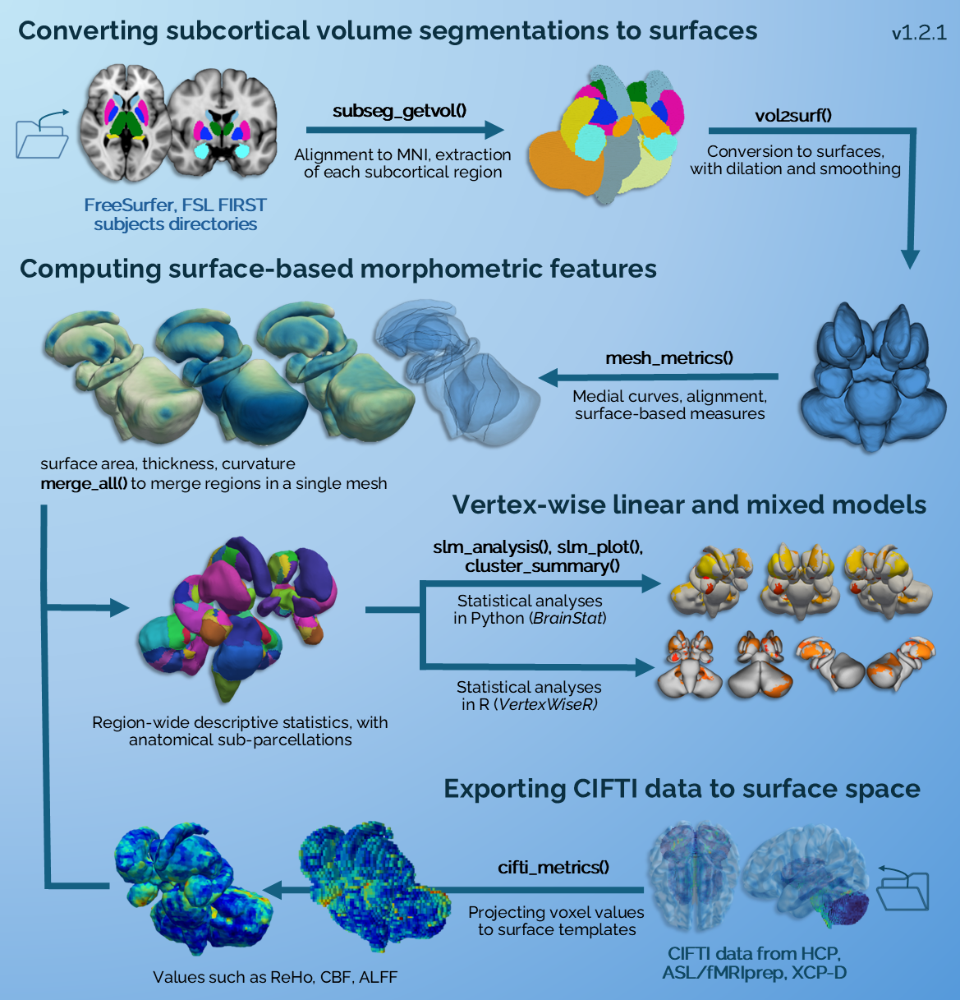
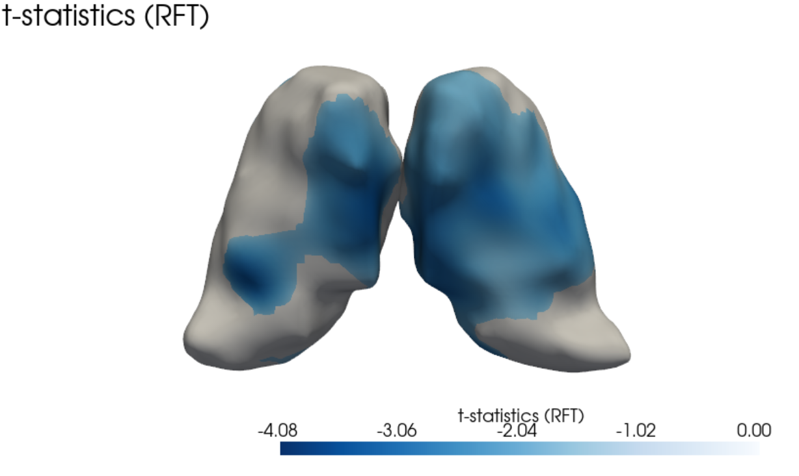
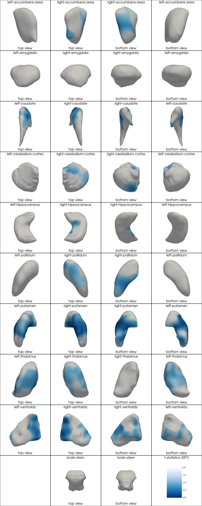

# SubCortexMesh

## Surface-based postprocessing of segmented subcortices in Python

This toolbox provides commands to process and analyse surface-based measures of subcortical segmentations from FreeSurfer and FSL FIRST, including thickness, surface area and curvature. Depending on the segmentation algorithm, compatible subcortices are: the **Thalamus**, **Caudate**, **Putamen**, **Pallidum**, **Hippocampus**, **Amygdala**, **Accumbens-area**, **Ventral diencephalon**, **Cerebellum**, and the **Brain-Stem**.

## Summary

- [Workflow](#workflow)
- [Installation](#installation)
- [Extracting and coregistering subcortical volumes](#extracting-and-coregistering-subcortical-volumes)
- [Converting volumes to surfaces](#converting-volumes-to-surfaces)
- [Visualising and inspecting converted surfaces meshes](#visualising-and-inspecting-converted-surfaces-meshes)
- [Computing surface-based metrics](#computing-surface-based-metrics)
- [Merging all surfaces](#merging-all-surfaces)
- [Statistical analyses](#statistical-analyses)

------------------------------------------------------------------------

## Workflow



The toolbox automatically converts a subjects directory's subcortical segmentation volumes to 3D surface meshes. SubCortexMesh:

-   Rigidly coregisters subject-space volumes to a template space (MNI). It solely does rotation and no interpolation to preserve subject-space dimensions.

-   Extracts individual regions-of-interest (ROIs) as separate volumes

-   Converts each volume to surface meshes using VTK's Discrete Marching Cube protocol, with additional dilating+eroding and smoothing to minimise artefacts (can be disabled or lowered)

-   Measures vertex-wise thickness (radial distance from a generated medial curve), surface area (1/3 of the area of the triangles a vertex is part of) and curvature (mean curvature).

-   Saves descriptive statistics for each ROI in a table for each subject and metric.

-   Aligns subject meshes and projects their vertex-wise values to a standard template-based surface, based on fsaverage/MNI305 for FreeSurfer outputs,[^1] and MNI152 for FSL FIRST outputs[^2]. The native space meshes, with their associated scalar metrics, can also be saved.

[^1]: The fsaverage/MNI305 surface-based templates for each ROI have been produced by using SubCortexMesh's own functions (subseg_getvol(), vol2surf()) with default parameters, on the fsaverage template's own aseg.mgz in FreeSurfer 7.4.1 (\$FREESURFER_HOME/subjects/fsaverage/mri/aseg.mgz).

[^2]: The fslfirst/MNI152 surface-based templates for each ROI have also been produced by using SubCortexMesh's own functions (subseg_getvol(), vol2surf()) with the same parameters (except smoothing=20). The segmentations volumes were obtained using FSL v.6.0.6's own probabilistic models (.bmv files in \$FSLDIR/data/first/models_336_bin/) on the standard MNI 152 1mm T1w volume (\$FSLDIR/data/standard/MNI152_T1_1mm_brain.nii.gz). Cerebellar meshes were produced using [run_first](https://fsl.fmrib.ox.ac.uk/fsl/docs/structural/first.html#advanced-usage), with "-n 40" modes, using the putamen intensities to normalise its intensity sample as recommended by the latter's documentation.

## Installation

SubCortexMesh can be installed via pip from the GitHub directory:

``` bash
pip install subcortexmesh
#Or to get the latest unreleased repository version:
#pip install git+https://github.com/chabld/SubCortexMesh.git
```

All SubCortexMesh computations are fully executed in Python, most functions mainly relying on the [VTK](https://vtk.org/) *v*9.5.2 module. Once imported in python, the toolbox requires base template data to be downloaded. The command below is triggered by every function that needs the data. It checks for its existence and if it is not found, it will assist users so they can download it in a default or custom path:

``` python
from subcortexmesh import template_data_fetch
toolboxdata=template_data_fetch(template='fsaverage') #or 'fslfirst'
```

## Getting started

### Extracting and coregistering subcortical volumes

The extraction of segmentation volumes is done on preprocessing subjects directories, where subcortical segmentations are available. Typically, a subject directory is the output `$SUBJECTS_DIR` for FreeSurfer's [recon-all pipeline](https://surfer.nmr.mgh.harvard.edu/fswiki/recon-all), and a directory where [run_first_all](https://fsl.fmrib.ox.ac.uk/fsl/docs/structural/first.html#segmentation-with-run_first_all) has sent its output in FSL. SubCortexMesh finds all subjects inside the directory and extracts their subcortical segmentation volumes ("aseg.mgz" in FreeSurfer,"\*all_fast_firstseg.nii.gz" in FSL). To facilitate later standardisation, those volumes are coregistered to their respective templates (fsaverage/MNI305 for FreeSurfer, MNI152 for FSL).

Below is the command that automatically extracts and coregisters all subcortical volumes of a subjects directory:

``` python
from subcortexmesh import subseg_getvol
subseg_getvol(
  inputdir="FreeSurfer_sub_directory/", 
  outputdir="/my_outputdir/",
  #toolboxdata="/user_path/subcortexmesh_data",
  overwrite=False, 
  silent=False)
```

Notes:

-   The path to the *toolboxdata* argument only needs to be specified if it was not downloaded to the default path, i.e. the user's home directory

-   SubCortexMesh follows the sub-\*\*\* convention for participant IDs and will only account for folders with names that contain such IDs.

-   In FSL FIRST, optional [cerebellar surfaces](https://fsl.fmrib.ox.ac.uk/fsl/docs/structural/first.html#advanced-usage) also need to be named \**L-Cereb_first.nii.gz* and \**R-Cereb_first.nii.gz*.[^3]

-   The coregistration requires T1 volumes to be present for each subject: it should be stored as [sub-ID]/mri/T1.mgz for FreeSurfer and stored in the same "inputdir" path for FSL FIRST (the function will search for files containing the sub-ID and "T1w.nii" for each subject).

[^3]: Cerebellar segmentations can be done in FSL with the following commands (do the same for `L_Cereb`): <br>
    `first_flirt [subject's T1file] "[subject's subdirectory]/[sub-id]" -cort` <br>
    `run_first -i [subject's T1file]` <br>
    `-t "[subject's subdirectory]/[sub-id_cort.mat]"` <br>
    `-n 40` <br>
    `-o "[subject's subdirectory]/[sub-id]-R_Cereb_first"` <br>
    `-m "${FSLDIR}/data/first/models_336_bin/intref_puta/R_Cereb.bmv"` <br>
    `-intref "${FSLDIR}/data/first/models_336_bin/05mm/R_Puta_05mm.bmv"` <br><br>
    The putamen used as the intensity reference is what is indicated by [FSL FIRST's documentation](https://fsl.fmrib.ox.ac.uk/fsl/docs/structural/first.html#advanced-usage) and 40 is just the number of modes used for most ROIs.

### Converting volumes to surfaces

*subseg_getvol()* will create a directory called "sub_volumes" inside the path given (*outputdir*). The path to sub_volumes can then be given to the following command in order to convert the volumes into surfaces:

``` python
from subcortexmesh import vol2surf
vol2surf(
    inputdir="/my_outputdir/sub_volumes",
    outputdir="/my_outputdir/",
    #roilabel=['left-thalamus','right-thalamus'], #if one wants to only compute specific ROIs
    #dilate_erode=True,
    #smoothing=15,
    plot_volnext2surf=True,
    overwrite=False,
    silent=False
    )
```

The *plot_volnext2surf()* argument is False by default, but allows users to check if they are satisfied with the resulting mesh. Below is an example with a left thalamus: A) shows the volume and the surface created from the former superimposed, B) the voxel-based volume, C) the vertex-wise surface (with VTK' [discrete marching cubes](https://vtk.org/doc/nightly/html/classvtkDiscreteMarchingCubes.html) method, no smoothing), D) the surface after dilation+erosion and smoothing.


Similarly, *vol2surf()* will create a directory called "sub_surfaces" inside the given outputdir.

### Visualising and inspecting converted surfaces meshes

For quality check, surfaces stored in "sub_surfaces" can also be plotted together on top of a subject's corresponding volume with the surf_qcplot() function. Because the surfaces are based on a volume rigidly coregistered to fsaverage, the surfaces will match a volume generated with subseg_getvol(), i.e. "sub_volumes/sub-[id]/ants_coreg/T1\_[template]\_rigid_coreg.nii.gz" (or any volume likewise coregistered):

``` python
from subcortexmesh import surf_qcplot
surf_qcplot(
    volpath="/my_outputdir/sub_volumes/sub-[id]/ants_coreg/T1_fsaverage_rigid_coreg.nii.gz",
    surfdir="/my_outputdir/sub_surfaces/sub-[id]",
    vol_color_map= "gray",
    outline_color_map = "tab20"
    )
```


Since regions will have been inflated and smoothed by default to minimise graphical artefacts (e.g. hanging sparse voxels, sharp mesh spikes), the boundaries naturally appear slightly wider than their original anatomy and overlapping. Note that because the surfaces are processed by SubCortexMesh entirely separately, the visual overlap has no effect on later metrics values. In any event, this can be run on surfaces produced with dilate_erode=False.

The autoqc_outliers() function helps quickly identify subject meshes that are outliers relatively to the cohort along five global heuristic shape features (volume, surface area, sphericity, elongation, symmetry). It returns a table stating for each subject and ROI, the number of features for which the ROI has been flagged as outlier (0-5).

``` python
from subcortexmesh import surf_qcplot, autoqc_outliers
flag_df = autoqc_outliers(inputdir="/my_outputdir/sub_surfaces/",
                          n_sd=2) #standard deviation at which to define outliers

#Using the table, one can specifically plot the outlying ROIs, here for at least 4 features.
for subid in flag_df.index:
    flagged_structures = [c for c in flag_df.columns if flag_df.loc[subid, c] >= 4]
    if not flagged_structures:
        continue
    print(f"{subid}: {flagged_structures}")
    surf_qcplot(
        volpath=f"{datapath}/ds003346_SCM/sub_volumes/{subid}/ants_coreg/T1_fsaverage_rigid_coreg.nii.gz",
        surfdir=f"{datapath}/ds003346_SCM/sub_surfaces/{subid}", 
        roilabel=flagged_structures)
```
A flagged ROI may still be fine and an anatomically correct segmentation, so users should inspect and decide for themselves whether it is valid or not. Outliers are relative to the values in the cohort and the features covered may be influenced by local structure such as brain volumes or ventricle volumes.

### Computing surface-based metrics

The path to sub_surfaces/ can then be given to the following command in order to compute mesh-wise metrics:

``` python
from subcortexmesh import mesh_metrics
mesh_metrics(
  inputdir="/my_outputdir/sub_surfaces",
  outputdir="/my_outputdir/", 
  #toolboxdata="/user_path/subcortexmesh_data",
  template='fsaverage',
  metric=['thickness','surfarea','curvature'], #default, can also be one string
  #roilabel=['left-thalamus','right-thalamus'], #if one wants to only compute specific ROIs
  smooth=[0,5,5], #FMHW smoothing for: thickness, surface area, curvature
  plot_medial_curve=True, 
  plot_projection=True, 
  native_meshes=True, 
  overwrite=True, 
  silent=False)
```

The measure will create a "surface_metrics/" directory in the *outputdir*. The *native_meshes* argument gives the option to also save .vtk surface meshes in native space, containing the scalars for each metric.

mesh_metrics() also saves native summary statistics tables in each subject directory. E.g., surface_metrics/sub-xxx/surfarea_stats.txt:

| label                | mean  | sd    | min   | max   | range | n_vert |
|:---------------------|:------|:------|:------|:------|:------|:-------|
| left-accumbens-area  | 0.683 | 0.205 | 0.158 | 1.242 | 1.084 | 806    |
| right-accumbens-area | 0.677 | 0.205 | 0.184 | 1.146 | 0.962 | 886    |
| left-amygdala        | 0.685 | 0.199 | 0.159 | 1.254 | 1.095 | 1288   |
| ...                  |       |       |       |       |       |        |

The plotting arguments are also False by default and allow users to check the computation process. The medial curve, the line crossing through the centre of the mesh (A) is fundamental to the thickness measure, as it is a measure of radial distance between the medial curve and the outer surface. It is also used to align the subject-space and template-space mesh further. Likewise, plotting the subject surface (B) and its template equivalent (C) shows how accurate the standardisation was.


### Merging all surfaces

It is possible to treat all ROIs as one and merge their vertex-wise surface metrics into one big mesh. This is what the following command accomplishes, subject-per-subject:

``` python
from subcortexmesh import merge_all
merge_all(
  inputdir="/my_outputdir/surface_metrics/,
  #toolboxdata="/user_path/subcortexmesh_data",
  template='fsaverage',
  plot_merged=True, 
  overwrite=False, 
  silent=False)
```
Even if all subcortical regions have not been created, the merge_all() function will add missing surfaces filled with NaN values instead of the metric values.[^4]

[^4]: If one subject has missing ROIs inside their merged mesh, slm_analysis() will not run on the missing ROIs' vertices in the statistical model.

The merged mesh is saved in the surface_metrics/ subject directories, e.g. allaseg_thickness.vtk for fsaverage based surfaces. The plotter lets you visualise the outcome of the merging (plot_merged calls vis_merged(), a function which can also independently plot each mesh or .vtk file). The 3D viewer has a slider to space out the regions to show internal parts:


While vis_merged() does the 3D slider view, vis_merged_flat() writes a .png 2D grid-like view where each pair of ROI, in top and bottom views, is laid out separately.

### Statistical analyses

Users can run statistical analyses on the surface-based metrics with any potential software that can work with .vtk meshes and read their metrics scalars. SubCortexMesh provides a small wrapper for [BrainStat's SLM analysis tools](https://brainstat.readthedocs.io/en/master/python/tutorials/tutorial_1.html#python-tutorial1), which fit linear or linear mixed models with surface-based values.  

The slm_analysis() function facilitates the process of collating surface data by reading scalars from every surface available with a (set of) selected region(s) and one metric, and appending them into a single numpy array (N subjects x V vertices). The collated meshes are ordered alphanumerically according to the subject IDs of the surface_metrics/ subfolders, so users need to make sure the order matches that of model/contrast variables (which contains behavioural/phenotypic variables to associate the surface metrics with).

The other arguments are that of the SLM function. Here is an example:

``` python
import pandas as pd
from brainstat.stats.terms import FixedEffect
from subcortexmesh import slm_analysis, slm_plot
#hypothetical behavioural data 
beh_data = pd.read_csv("participants.tsv", sep="\t")
beh_data = beh_data.dropna(subset=['age'])
#prepare model as per BrainStat's terms system 
model = FixedEffect(beh_data['age']) #can include additional columns as variables to control for
contrast = beh_data['age'] #the main effect of interest
#Testing the effect of age on the bilateral thalami
slm_model = slm_analysis(
    inputdir="surface_metrics/",
    metric='thickness',
    roilabel=['left-thalamus','right-thalamus'],
    model=model,
    contrast=contrast,
    correction=["fdr", "rft"],
    cluster_threshold=0.05,
    smooth=5, #optional FMHW smoothing of the metric values 
    sub_list=beh_data['participant_id'] #optional inclusion list to avoid mismatching model and surface data
)
```

Description for significant clusters can be printed with the following command:

``` python
cluster_summary(slm_model, template='fsaverage')
```
```Output
{'Positive contrast': 'No significant clusters',
 'Negative contrast':    clusid  nverts       P      X      Y      Z  tstat          region
 0       1  2713.0  <0.001  152.0  120.4  153.6  -4.08   left-thalamus
 1       2  1846.0  <0.001  125.3  132.8  142.0  -3.53  right-thalamus}
```

Once the analysis is complete, the outputted cluster maps in the SLM object (here slm_model) can be visualised as follows:

``` python
slm_plot(
  slm=slm_model, 
  stat='t_rft',
  cmap='Blues_r', #optional, automatically set
  threshold= .05,
  smooth_mesh=20 #cosmetic mesh smoothing
  )
```



Options for the "stat" argument include:

-   't' for the t-statistics map
-   't_fdr' for the t-statistics maps filtered via false discovery rate (FDR) significance (use threshold argument)
-   't_rft' for the t-statistics maps  filtered based on significance of random field theory (RFT) cluster-wise p-values (use threshold argument)
-   'p_fdr' for the FDR-corrected p-value map
-   'p_rft' for the p-values filtered based on significance of RFT cluster-wise p-values (use threshold argument)
-   'clusters' for the identified clusters

The same model can be run to test the effect on a global merged surface produced by merge_all(). It can then be plotted in slm_plot(), via vis_merged()'s 3D slider view previously shown (mode='anatomical'), or via vis_merged_flat() for a 2D grid-like view (mode='flat'):

``` python
slm_model_allaseg = slm_analysis(
    inputdir='surface_metrics/',
    metric='thickness',
    roilabel='allaseg',
    model=model,
    contrast=contrast,
    correction=["fdr", "rft"],
    cluster_threshold=0.05,
    smooth=5,
    sub_list=beh_data['participant_id']
)

slm_plot(
    slm=slm_model_allaseg, 
    stat='t_rft', 
    smooth_mesh=30, 
    threshold=0.05, 
    mode='flat',
    flatmode_filepath='flat_plot.png')
```



Other sets of analyses, including BrainStat's SLM as well as threshold-free cluster enhancement cluster analyses, are available in the R package [VertexWiseR](https://github.com/CogBrainHealthLab/VertexWiseR), which is able to [extract](https://cogbrainhealthlab.github.io/VertexWiseR/articles/VertexWiseR_surface_extraction.html) and [analyse](https://cogbrainhealthlab.github.io/VertexWiseR/articles/VertexWiseR_Example_3.html) outputs from SubCortexMesh.