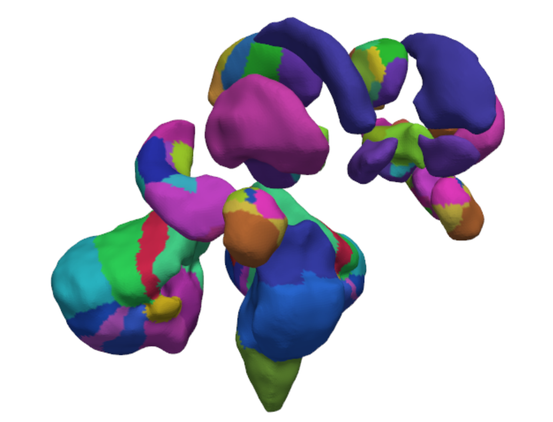
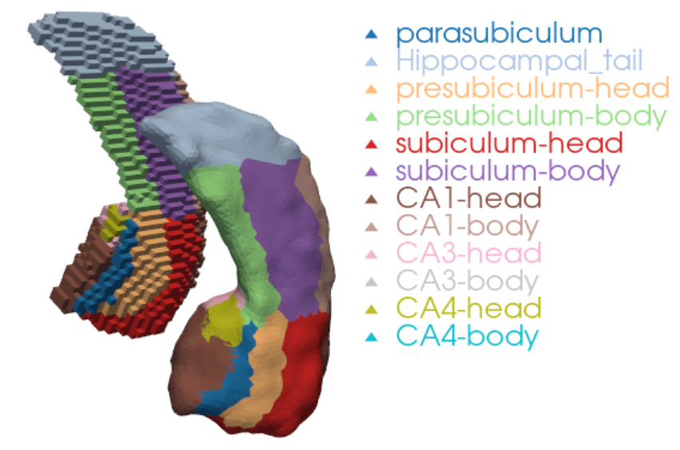
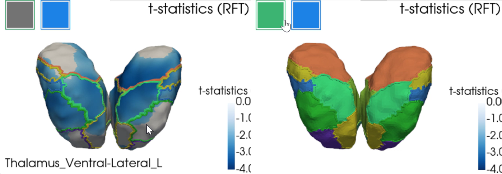

# Surface-based atlases and subsections

## Anatomical atlas

An anatomical atlas has been created in surface space for SubCortexMesh (SCM)'s ASeg-derived "fsaverage" template to help users identify more precisely where their statistical results are located in subcortical regions-of-interest (ROIs). This anatomical atlas is based on existing volume-based atlases that were projected to surface templates with a number of manual fine-tuning to produce a rough estimate of which ROIs are surface vertices located in. We detail here how it was built and how to use it in SCM.



⚠️ Because it is a graphical projection, not delineated sections directly derived from brain scans, and since the template surfaces are asymmetrical, the ROIs must be interpreted as a broad guidance for reference rather than precisely certain locations. 

## Summary

- [Development details](#development-details)
    - [Volumetric atlas extraction](#volumetric-atlas-extraction)
    - [Volume to surface projection](#volume-to-surface-projection)
- [How to use them in SubCortexMesh](#how-to-use-them-in-subcortexmesh)
- [Lookup tables](#lookup-tables)
- [References](#references)

------------------------------------------------------------------------

## Development details

### Volumetric atlas extraction

Depending on the subcortical region, labels from various volumetric atlases were selected. Because of high granularity lost or scrambled upon conversion to surface, some ROIs were merged, and other excluded, especially when buried inside regions or too subtle to be correctly captured on the surface "shell". We also took advantage of FreeSurfer _freeview_'s "3D isosurface" view to guide assessment of the converted surfaces.

The atlas includes the following subsegmentations:

- **Globus pallidus interna and externa:** we relied on the CIT168 atlas from the CIT68 Reinforcement Learning Atlas (Pauli, Nili & Tyszka, 2018), using the MNI 152 space. Specifically, "CIT168_Reinf_Learn_v1.1.0/MNI152-Nonlin-Asym-2009c/CIT168toMNI152-2009c_det.nii" in [OSF](https://doi.org/10.17605/OSF.IO/R2HVK). The atlas was split to distinguish left and right ROIs.

- **Cerebellar layers:** we relied on the Diedrichsen 2009 atlas (Diedrichsen et al., 2009; Diedrichsen et al., 2011). Specifically, the [probability atlas](https://github.com/DiedrichsenLab/cerebellar_atlases/tree/master/Diedrichsen_2009) in MNI space ("atl-Anatom_space-MNISym_probseg.nii") was converted to volumetric segmentations with minimal threshold (whichever label had the strongest value above 0). 
Regions excluded as outside of the FreeSurfer ASeg segmentation were Vernis Crus I, Vermis X, dentate nuclei, interposed nuclei and fastigial nuclei. Other Vermis areas, although strictly inside SCM's shapes either, were kept to label the medial sides of the cerebellar surfaces connected to them.

- **Thalamic nuclei:** we relied on FreeSurfer (Fischl, 2012)'s [Subcortical Segmentations](https://freesurfer.net/fswiki/SubcorticalSegmentation), which provide Iglesias et al. (2018)'s probability atlases [in MNI space](https://surfer.nmr.mgh.harvard.edu/fswiki/SubfieldAtlasesICBMspace) (specifically, "ThalamusProbs.MNIsymSpace.nii.gz"). The atlas was converted to volumetric segmentations with minimal threshold (whichever label had the strongest value above 0). Due to their granularity, several ROIs were merged per broader categories (see [Iglesias et al. (2018), Table 2](https://arxiv.org/pdf/1806.08634)): Lateral (LD, LP), Ventral anterior (VA, VAmc), Ventral lateral (VLa, VLp), Intralaminar (CM, Pf).
Excluded ROIs included: Lateral and medial geniculate nuclei (LGN and MGN) as outside of the classic ASeg segmentation; Mediodorsal lateral parvocellular (MDl), Pulvinar anterior (PuA) as deep inside the volume, so not corresponding to any outer surface; Reticular nucleus (R) since it is a thin outer layer covering multiple nuclei and cutting through other volumes creating artefacts; Ventromedial nucleus (VM), paracentral (Pc) and paratenial (Pt) which did not end in the probability atlas when converted to volumetric segmentation at all; Central lateral intralaminar (CL), Reuniens (MV-re) as too subtle for meaningful surface projection.

- **Hippocampal subfields:** we also relied on the FreeSurfer Subcortical Segmentations, using the atlas from Iglesias et al. (2015a) (specifically, "HippoAmygProbs.MNIsymSpace.left.nii.gz" and "HippoAmygProbs.MNIsymSpace.right.nii.gz"), with the same probability thresholding approach.
Excluded ROIs included: GC-DG, molecular layer, and hippocampal fissure, as deep inside the volume, so not really matching the outer surface; alveus and fimbria, as too subtle for surface projection; and HATA, as outside of the classic ASeg segmentation.

- **Amygdalar nuclei:** we also relied on the FreeSurfer Subcortical Segmentations, using the atlas from Saygin & Kliemann et al. (2017) (likewise, "HippoAmygProbs.MNIsymSpace.left.nii.gz" and "HippoAmygProbs.MNIsymSpace.right.nii.gz"), with the same probability thresholding approach.
Excluded ROIs included: Anterior-amygdaloid-area, as outside the ASeg volume; Medial nucleus as too subtle for surface projection; and Paralaminar nucleus, as it's a thin outer layer covering multiple nuclei, cutting through other volumes and creating artefacts.

- **Brain-Stem main sections:** we also relied on the FreeSurfer Subcortical Segmentations, using the atlas from Iglesias et al. (2015b) (specifically, using "BrainstemProbs.MNIsymSpace.nii.gz") with the same probability thresholding approach.

- **Ventral diencephalon (DC) subcomponents:** we created our own volumetric atlas, likewise made of different volumetric atlases, stitched together to "populate" the parts of the ventral DC, called ["Ventral DC Frankenstein"](https://github.com/chabld/Ventral_DC_Frankenstein). The atlas included [Brainstem Navigator](https://www.nitrc.org/projects/brainstemnavig/)'s atlas (García-Gomar et al., 2019; Singh et al., 2021) for the medial and lateral geniculate nuclei (specifically taken from "2b.DiencephalicNucleiAtlas_MNI"), with >0 probability threshold as opposed to 0.35 (which was justified by the Ventral DC's own rough delineation as opposed to the high resolution segmentation the Brainstem Navigator is based upon). It also included the John Hopkins University (JHU)'s DTI atlas (Hua et al. 2008; Wakana et al. 2007) for the cerebral peduncles, (specifically, the [neurovault ICBM 1mm version](https://identifiers.org/neurovault.image:1401)). Finally, it made use of the same CIT168 atlas as for the pallidum (Pauli et al., 2018) due to its overlapping labels (Hypothalamus, Red nucleus etc.). The subtantia nigras's two pars were merged, as well as the parabrachial pigmented and ventral tegmental area, to facilitate volume-to-surface projection due to difficulty distinguishing them in the projected surface.

Note about MNI space: SCM's surface template are based on ASeg which is strictly speaking in MNI305 space. CIT168 and Diedrichsen 2009 were resamped to MNI305 (ASeg's space) using the Neuroatlas R package's [MNI152_to_MNI305](https://bbuchsbaum.github.io/neuroatlas/reference/MNI305_to_MNI152.html) transformation matrices (Buchsbaum, 2006; see R/coordinate_spaces.R). FreeSurfer's subcortical segmentations were simply resampled with the same software's "mri_vol2vol --regheader" which gave satisfying results.


### Volume to surface projection

Volume labels were projected to their corresponding template surface object, for each ROI one by one, using the Visualization Toolkit (VTK v9.5.2; Schroeder, Martin & Lorensen, 2006) in Python. The volume regions were aligned with their respective SCM surface template as consistently and closely as possible, with automated centroid alignment, manual fine-tuning of the coordinates, and manual tweaking of their scale. 
Once satisfying spatial correspondance was achieved, we projected their atlas voxel-wise label values to the nearest vertices in the surface, using SciPy (v1.15.2; Virtanen et al. 2020)'s Euclidean Distance Transform. Further smoothing was applied to minimise presence of sparse triangles.

The following screenshot shows an example of a surface-based right hippocampus next to its respective voxel-based volume:



------------------------------------------------------------------------

## How to use them in SubCortexMesh

As of version 1.1.0, the data fetched via template_data_fetch() also downloads the "atlas" subdirectory for the fsaverage template, which includes an array with values corresponding to each vertex in template space ("anatomical_atlas_fsaverage.npy") - following the order of the allaseg_roi_id.txt reference - and a lookup table with the labels matching each value ("anatomical_atlas_fsaverage_names"). 

Now, mesh_metrics() will not only print summary statistics for the broad ROIs in native space, but also for the atlas subsegmentations in template space. A .txt called "[measure]_stats_atlas.txt" will show rows such as:

| Label                                | Mean   | SD    | Min   | Max    | Range  | n_vert |
|--------------------------------------|--------|-------|-------|--------|--------|--------|
| Brain_Stem_Medulla                   | 7.818  | 3.500 | 1.419 | 17.271 | 15.852 | 2431   |
| Brain_Stem_Pons                      | 13.417 | 2.161 | 4.965 | 18.040 | 13.075 | 4716   |
| Brain_Stem_Superior_Cerebellar_Peduncle | 14.934 | 0.496 | 13.759 | 15.870 | 2.111  | 117    |
| Brain_Stem_Midbrain                  | 9.272  | 3.291 | 0.425 | 16.580 | 16.155 | 2188   |
...

⚠️ When interpreting thickness, one must keep in mind that it is a radial distance from the medial curve, not from the true end of any subfield/nucleus' shape. Thicker vertices in a given ROI could but not necessarily would mean that the area is thicker, as it would still appear thicker if an inner layer was "pushing out" the outer layer that the atlas is delineating.

The vis_merged(), vis_merged_flat() and slm_plot() all include the option to show atlas colours and/or outlines via the atlas_map boolean argument. When set to _True_, the 3D visualisers will include two buttons, one to show the labelling values, a second their outline, on top of the main mesh values. Hovering the cursor on top of each ROI will display the label name in the bottom left corner of the window. The 2D vis_merged_flat() output only includes the outlines, along with a legend in the bottom left box.

Here is an example with the bilateral thalami example statistical outputs from the website's main page and overlaid atlas labels:

``` python
slm_plot(slm_model, 't_rft', cmap='Blues_r', smooth_mesh=10, threshold=.05, atlas_map=True)
```



Those also appear in the cluster_summary() function, indicating the subregion where a cluster's peak _t_ statistics vertex is located, if applicable:

``` python
cluster_summary(slm_model, template='fsaverage')
```
```Output
{'Positive contrast': 'No significant clusters',
 'Negative contrast':    clusid  nverts       P      X      Y      Z  tstat          region                          atlas
 0       1  2713.0  <0.001  152.0  120.4  153.6  -4.08   left-thalamus    Thalamus_Pulvinar-Lateral_L
 1       2  1846.0  <0.001  125.3  132.8  142.0  -3.53  right-thalamus  Thalamus_Mediodorsal-Medial_R}
 ```

## Lookup tables

The table below lays out every region included in the anatomical atlas along with their corresponding IDs and labels:

````{csv-table} Subcortical Atlas Labels
:file: _static/anatomical_atlas_fsaverage_names.txt
:header-rows: 1
:class: scrollable-table
````

# References

<div class="small-text">

- Buchsbaum B (2026). neuroatlas: Neuroimaging Atlases and Parcellations. R package version 0.1.0, https://github.com/bbuchsbaum/neuroatlas.
- Diedrichsen, J., Balsters, J. H., Flavell, J., Cussans, E., & Ramnani, N. (2009). A probabilistic atlas of the human cerebellum. Neuroimage.
- Diedrichsen, J., Maderwald, S., Kuper, M., Thurling, M., Rabe, K., Gizewski, E. R., et al. (2011). Imaging the deep cerebellar nuclei: A probabilistic atlas and normalization procedure. Neuroimage.
- Fischl, B. (2012). FreeSurfer. Neuroimage, 62(2), 774-781.
- García-Gomar, M. G., Strong, C., Toschi, N., Singh, K., Rosen, B. R., Wald, L. L., & Bianciardi, M. (2019). In vivo probabilistic structural atlas of the inferior and superior colliculi, medial and lateral geniculate nuclei and superior olivary complex in humans based on 7 Tesla MRI. Frontiers in neuroscience, 13, 764.
- Hua, K., Zhang, J., Wakana, S., Jiang, H., Li, X., Reich, D. S., ... & Mori, S. (2008). Tract probability maps in stereotaxic spaces: analyses of white matter anatomy and tract-specific quantification. Neuroimage, 39(1), 336-347.
- Iglesias, J. E., Augustinack, J. C., Nguyen, K., Player, C. M., Player, A., Wright, M., ... & Alzheimer's Disease Neuroimaging Initiative. (2015a). A computational atlas of the hippocampal formation using ex vivo, ultra-high resolution MRI: Application to adaptive segmentation of in vivo MRI. Neuroimage, 115, 117-137.
- Iglesias, J. E., Van Leemput, K., Bhatt, P., Casillas, C., Dutt, S., Schuff, N., ... & Alzheimer's Disease Neuroimaging Initiative. (2015b). Bayesian segmentation of brainstem structures in MRI. Neuroimage, 113, 184-195.
- Iglesias, J. E., Insausti, R., Lerma-Usabiaga, G., Bocchetta, M., Van Leemput, K., Greve, D. N., ... & Alzheimer's Disease Neuroimaging Initiative. (2018). A probabilistic atlas of the human thalamic nuclei combining ex vivo MRI and histology. Neuroimage, 183, 314-326.
- Pauli, W. M., Nili, A. N., & Tyszka, J. M. (2018). A high-resolution probabilistic in vivo atlas of human subcortical brain nuclei. Scientific data, 5(1), 180063. 
- Saygin, Z. M., Kliemann, D., Iglesias, J. E., van der Kouwe, A. J., Boyd, E., Reuter, M., ... & Alzheimer's Disease Neuroimaging Initiative. (2017). High-resolution magnetic resonance imaging reveals nuclei of the human amygdala: manual segmentation to automatic atlas. Neuroimage, 155, 370-382.
- Schroeder W, Martin K, Lorensen B. The Visualization Toolkit (4th Ed.). Kitware; 2006.
- Singh, K., García-Gomar, M. G., & Bianciardi, M. (2021). Probabilistic atlas of the mesencephalic reticular formation, isthmic reticular formation, microcellular tegmental nucleus, ventral tegmental area nucleus complex, and caudal–rostral linear raphe nucleus complex in living humans from 7 Tesla magnetic resonance imaging. Brain Connectivity, 11(8), 613-623.
- Virtanen P, Gommers R, Oliphant TE, et al. SciPy 1.0: fundamental algorithms for scientific computing in Python. Nat Methods. 2020;17(3):261-272. doi:10.1038/s41592-019-0686-2
- Wakana, S., Caprihan, A., Panzenboeck, M. M., Fallon, J. H., Perry, M., Gollub, R. L., ... & Mori, S. (2007). Reproducibility of quantitative tractography methods applied to cerebral white matter. Neuroimage, 36(3), 630-644.

<div>