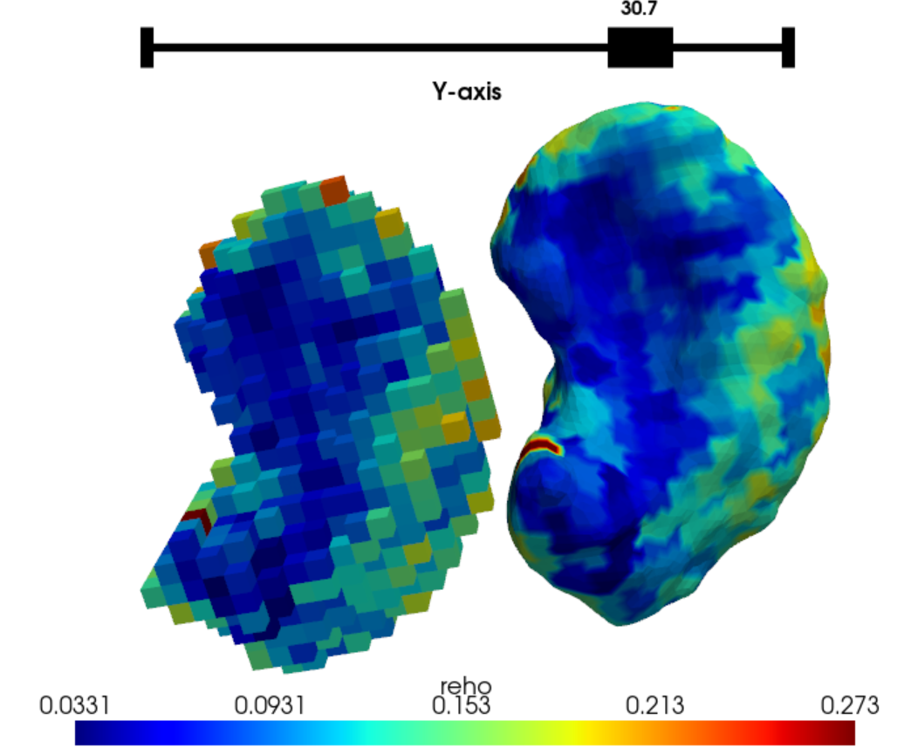

# CIFTI subcortical data

SubCortexMesh is compatible with CIFTI FsLR data which contains grayordinates for subcortical regions. It can convert them to surfaces in SubCortexMesh's own fsaverage space, then plot and analyse the regions accordingly. 

"Connectivity Informatics Technology Initiative" (CIFTI) files are produced by Washington University–University of Minnesota Human Connectome Project Consortium (WU–Minn HCP) processing pipelines (Glasser et al. 2013). CIFTI files can also be generated by preprocessing software such as [fMRIprep](https://fmriprep.org/) (Esteban et al. 2019), [sMRIprep](https://www.nipreps.org/smriprep/) (Esteban et al., 2021), [ASLprep](https://aslprep.readthedocs.io) (Adebimpe et al., 2022), or [XCP-D](https://xcp-d.readthedocs.io/) (Mehta et al. 2024). 

# Extracting CIFTI files

From a subjects directory, SubCortexMesh can use the CIFTI dense scalar files (.dscalar), which contain values of interest in subcortical voxel-space. Because these volumes come from FreeSurfer's ASeg subcortical segmentation, SubCortexMesh projects them on surface templates that are also based on the ASeg segmentations (resampling the volumes in fsaverage/MNI305 space).

This is done with the cifti_metrics() function. For example, the code below extracts Regional Homogeneity data outputted inside a XCP-D postprocessing subjects directory:

``` python
from subcortexmesh import cifti_metrics

cifti_metrics(dscalar = "space-fsLR_den-91k_stat-reho_boldmap.dscalar", #specific file pattern to identify
              metric= 'reho', #will be used to name the data, make sure it matches the dscalar
              roilabel = 'left-putamen', #by default, all available regions will be selected
              inputdir= "ds005237_postproc_xcpd/",
              outputdir = "ds005237_SCM/", 
              plot_projection = True,
              overwrite=False)
```

Excerpt of the output:

```
Extracting CIFTI data for sub-NDARINVAH529JMM... [5/91]
=> Loading task-restAP_run-01 scalar...
   => left-putamen...
=> Loading task-restAP_run-02 scalar...
   => left-putamen...
=> Loading task-restPA_run-01 scalar...
   => left-putamen...
```

The plot_projection argument allows users to inspect the voxel-to-surface projection:



The outputted data is similar to that of mesh_metrics(), with cifti_metrics() creating a directory named 'surface_metrics_cifti/', that contains the .vtk surfaces for each region of interest with their CIFTI metric values as scalar (in separate subdirectories per session-, task-, run- and acq- etc. when applicable). 

# Statistics

cifti_metrics() automatically produces summary statistics in template space in a "stats" directory for each subjects, with tables summarising the metric vlaues per region and atlas parcellation:

| Label                 | Mean  | SD    | Min   | Max   | Range | n_vert |
|-----------------------|-------|-------|-------|-------|-------|--------|
| left-accumbens-area   | 0.115 | 0.033 | 0.056 | 0.226 | 0.170 | 1022   |
| right-accumbens-area  | 0.114 | 0.037 | 0.037 | 0.219 | 0.182 | 1022   |
| left-amygdala         | 0.132 | 0.059 | 0.051 | 0.522 | 0.471 | 1638   |
| right-amygdala        | 0.121 | 0.039 | 0.037 | 0.244 | 0.208 | 1792   |
... 

Vertex-wise analyses can also be applied the same way the outputs of mesh_metrics(), the only difference being the "metric" specified is now one of the CIFTI scalars (e.g., 'reho') instead of thickness, surfarea or curvature.

## References

- Adebimpe, Azeez, et al. "ASLPrep: a platform for processing of arterial spin labeled MRI and quantification of regional brain perfusion." Nature Methods 19.6 (2022): 683-686.
- Esteban, O., Markiewicz, C. J., Blair, R. W., Moodie, C. A., Isik, A. I., Erramuzpe, A., ... & Gorgolewski, K. J. (2019). fMRIPrep: a robust preprocessing pipeline for functional MRI. Nature methods, 16(1), 111-116.
- Esteban, O., Markiewicz, C. J., Blair, R. W., Poldrack, R. A., & Gorgolewski, K. J. (2021). sMRIPrep: structural MRI PREProcessing workflows. Zenodo.
- Glasser, M. F., Sotiropoulos, S. N., Wilson, J. A., Coalson, T. S., Fischl, B., Andersson, J. L., ... & Wu-Minn HCP Consortium. (2013). The minimal preprocessing pipelines for the Human Connectome Project. Neuroimage, 80, 105-124.
- Mehta, K., Salo, T., Madison, T. J., Adebimpe, A., Bassett, D. S., Bertolero, M., … & Satterthwaite, T. D. (2024). XCP-D: A Robust Pipeline for the post-processing of fMRI data. Imaging Neuroscience, 2, 1-26. doi:10.1162/imag_a_00257.